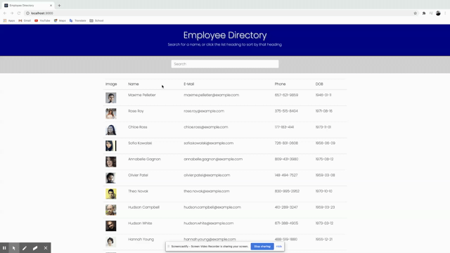

# MT-Employee-Directory

## Description 

You have a ton of people on your team and sometimes you just need to find someone in particular so you can shoot them an email or drop them a line. Or you can't remember what they look like, or you want to find out how many candles to buy for that monthly office birthday cake. We can help you out!

## TABLE OF CONTENTS

1. [Installation](#Installation)
2. [Usage](#Usage)
3. [Contributing](#Contributing)
4. [Tests](#Tests)
5. [Questions/Contact](#Questions/Contact)
6. [License](#License)

## Installation

Simply navigate to .

## Usage

This site accesses an API for a random set of users, but if you provide us with a database of your employees, we could tailor the site to work for your needs.

Start typing in the search field and your employees will be filtered to only include what matches the letters in the search field.

Clicking on any of the field names (with the exception of the **image** column, will allow you to toggle sorting between ascending and descending, depending on whether the data is alphabetized or organized numerically.

## Contributing

If you would like to contribute to this project, please contact me with the information below. You are incouraged to follow the [Contributor Covenant](https://www.contributor-covenant.org/). 

## Tests

Please refer to the `package.json` file for available tests.

## Questions/Contact

GitHub Profile: [https://github.com/Torontow](https://github.com/Torontow)
Email: [mtorontow0@gmail.com](mailto:mtorontow0@gmail.com)

## License

This project is covered under MIT license.

[Top](#MT-Employee-Directory)
